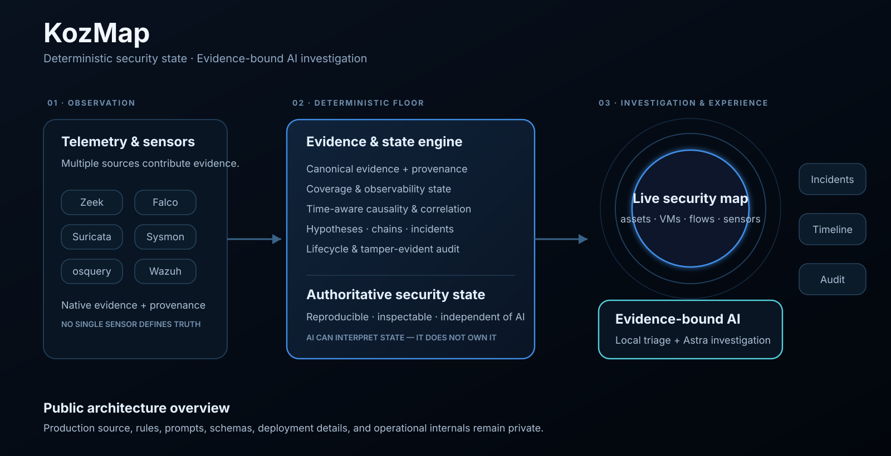

# KozMap — Cybersecurity Platform

**Deterministic security state · Evidence-bound AI investigation · Spatial security operations**

**kozmap.ch**

> **Public product showcase.** KozMap is a privately developed cybersecurity platform. This repository presents the product, its architecture, and its engineering principles. The production implementation remains private.

### ▶ [Watch the live map demo](https://github.com/JD-Vellino/kozmap-cybersecurity-platform/blob/main/assets/kozmap-main-page.mp4?raw=1)

## What is KozMap?

KozMap is a cybersecurity platform built to turn fragmented telemetry into a coherent, persistent model of an environment.

Traditional security tooling often asks analysts to reconstruct reality from alert queues, tables, dashboards, and separate sensor consoles. KozMap takes a different approach: **assets, virtual machines, sensors, network activity, evidence, hypotheses, attack chains, incidents, coverage, and audit history are represented as parts of the same stateful system.**

The objective is not simply to collect more telemetry. It is to make security state **inspectable, explainable, and operationally useful**.

## The architecture

  

KozMap separates security operations into three distinct layers.

### 1. Observation

Multiple network, endpoint, and runtime sources contribute evidence.

The architecture is deliberately source-agnostic: no single sensor family or SIEM defines the platform's truth model. Native observations retain their provenance while KozMap builds a consistent security view across the environment.

Current integrations include technologies such as **Zeek, Falco, Suricata, Sysmon, osquery, and Wazuh-compatible environments**.

### 2. Deterministic evidence & state

The authoritative security layer is deterministic.

Observed events can contribute to evidence, hypotheses, causal chains, and incidents. Coverage state, lifecycle transitions, provenance, correlation, and audit history exist independently of any language model.

That separation is deliberate: a security system should remain reproducible and inspectable even when the AI layer changes.

### 3. Investigation & operator experience

The same underlying state is exposed through the live map, timelines, chains, incidents, search, audit surfaces, and AI-assisted investigation.

AI sits **above** the deterministic floor rather than replacing it.

---

## A security environment you can see

KozMap's primary workspace is a live spatial security map rather than a conventional table-first dashboard.

Physical systems form the environment. Virtual machines remain associated with their hosts. Sensor presence shows where visibility exists. The gateway represents the network edge. Observed network activity moves across factual source-to-destination relationships.

The visual language is semantic rather than decorative:

- a **coverage gap** is different from an offline sensor;
- stale evidence is different from fresh evidence;
- remembered topology is different from current activity;
- observed traffic is different from authoritative asset ownership;
- a hypothesis is different from a confirmed incident.

The purpose of the map is to reduce the amount of mental reconstruction required before an analyst can understand what is happening.

## Deterministic first. AI second.

KozMap treats AI as an interpretation layer, not as the owner of security truth.

A bounded local reasoning layer can perform first-pass analysis, while **Astra** provides deeper investigation over retrieved evidence and structured context.

The operating principle is simple:

> **AI interprets evidence. It does not manufacture security truth.**

Astra is designed around explicit epistemic constraints. Among other things, the reasoning layer must keep **event freshness, sensor health, and asset coverage** conceptually separate; avoid turning observed peer IPs into ownership claims; treat advisory ATT&CK metadata as context rather than proof; and leave unsupported conclusions unresolved.

This lets the AI layer be useful without allowing model confidence to overwrite evidentiary reality.

## What KozMap models

At a high level, the platform maintains:

| Domain | Purpose |
| --- | --- |
| **Assets & topology** | Physical systems, virtual machines, gateways, and observed relationships |
| **Sensor coverage** | What is active, stale, offline, missing, or not authoritatively linked |
| **Evidence** | Durable observations with source provenance |
| **Hypotheses** | Possible explanations that remain explicitly provisional |
| **Chains** | Related evidence connected across time and context |
| **Incidents** | Promoted security situations with lifecycle state |
| **Audit history** | Traceable state changes and operator actions |
| **AI investigations** | Evidence-grounded reasoning over the same underlying state |

## Product surfaces

The private KozMap platform currently includes coordinated views such as:

**Map · Overview · AI Room · Incidents · Timeline · Chains · Hypotheses · Suppressions · Audit Log · Search · Administration · Reporting**

These are not separate data silos. They are different operational views over the same evidence and state model.

## Engineering principles

**Evidence before inference.**  
Observed facts, deterministic context, and AI interpretation remain distinguishable.

**State over alert streams.**  
Security activity persists as an evolving model instead of disappearing into a queue.

**Truthful uncertainty.**  
Unknown remains unknown. Missing visibility remains visible.

**Source-agnostic design.**  
The platform is not architecturally dependent on one SIEM or one sensor vendor.

**Causality over coincidence.**  
Time, identity, topology, and supporting evidence are used to establish meaningful relationships.

**Auditability.**  
Important lifecycle and state transitions are designed to remain traceable and reviewable.

**Replaceable AI.**  
The reasoning layer can evolve without becoming the authority for security state.

## Public / private boundary

KozMap's production implementation is private by design.

This repository intentionally contains only:

- selected public visuals and demos;
- high-level architecture;
- product concepts;
- engineering principles.

It intentionally does **not** publish:

- production source code;
- internal APIs or routes;
- detection and correlation logic;
- database schemas;
- model prompts or investigation broker internals;
- deployment or infrastructure configuration;
- credentials, secrets, telemetry, or customer data.

## Status

KozMap is under active private development.

This repository exists to show **what the product is, the architectural ideas behind it, and the operator experience** — without turning the production system into an open-source release.

---

**KozMap**  
*Cybersecurity platform for deterministic state, evidence-driven investigation, and spatial security operations.*

**JD Vellino** · AI Automation Consultant · Agentic AI · Deterministic Workflows
