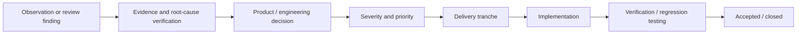

# Product Ownership & Delivery

KozMap is a technically complex product spanning telemetry, deterministic state, security reasoning, AI-assisted investigation, operator UX, packaging, lifecycle, and deployment concerns.

The product-management challenge is therefore not simply to maintain a list of tasks. It is to make uncertainty, risk, dependencies, and acceptance visible enough that the next engineering decision is clear.

This document describes the public, sanitized version of that delivery model.

## Delivery model

KozMap uses a living engineering ledger as the source of truth for active product and engineering work.

A tracked item carries enough context to answer four different questions:

| Dimension | Question |
| --- | --- |
| **Severity** | How consequential is the issue or gap? |
| **Priority** | When should it be addressed relative to other work? |
| **State** | Is it backlog, verification, active implementation, or closed? |
| **Acceptance** | Has the intended behaviour actually been validated? |

These dimensions are deliberately separate. A technically severe item is not automatically the next item to implement; dependencies, release risk, product value, and confidence in the root cause also matter.

## From finding to accepted change



The distinction between **implementation** and **acceptance** matters. Code being written does not, by itself, close a product concern.

## Prioritisation principles

KozMap uses a few simple rules to prevent the backlog from becoming an undifferentiated queue:

1. **Correctness before polish.** Product truth, attribution, lifecycle correctness, and security boundaries take precedence over cosmetic refinement.
2. **Security and product-blocking risk before maintainability debt.** Maintainability matters, but it should not displace work that affects trust, safety, recovery, or release viability.
3. **Verify before patching when the root cause is uncertain.** A suspected problem remains a verification item until the evidence is strong enough to scope the right fix.
4. **Dependencies shape order.** Related work is grouped into tranches so that prerequisites are completed before downstream productisation.
5. **Acceptance requires evidence.** Regression tests, live verification, or another appropriate acceptance mechanism are used before an item is considered closed.

## Example: lifecycle tranche

A sanitized example of delivery sequencing is the packaging and lifecycle tranche:

```text
Backup hardening
        ↓
Same-release recovery validation
        ↓
Transactional upgrade / rollback
        ↓
Release lifecycle considered complete
```

This is deliberately sequenced rather than treated as four unrelated tickets. Reliable upgrade behaviour is much more valuable when backup and recovery semantics are already known and verified.

## Review-driven backlog growth

A growing backlog is not automatically a sign of declining progress.

As KozMap moves through architecture review, security review, external UI QC, and productisation review, previously implicit assumptions and risks are converted into explicit tracked work.

That can temporarily increase the denominator faster than items are closed.

The useful product signal is therefore not a single completion percentage. It is whether:

- unknown risk is becoming known;
- high-consequence work is visible and prioritised;
- dependencies are explicit;
- verification is separated from implementation;
- closed items have actually met their acceptance criteria.

## Why the tracker exists

The progress tracker is generated from the ledger rather than maintained as a separate source of truth.

Its job is to provide a fast delivery view across:

- completed, active, verification, and backlog work;
- delivery tranches;
- severity and priority;
- backlog evolution over time;
- the transition from review finding to accepted remediation.

The dashboard is intentionally a visualization of the delivery system, not the delivery system itself.

## Public / private boundary

This public document describes the management model, not the private engineering ledger.

Detailed security findings, implementation specifics, internal routes, detection logic, infrastructure configuration, and other operationally sensitive material remain private.
